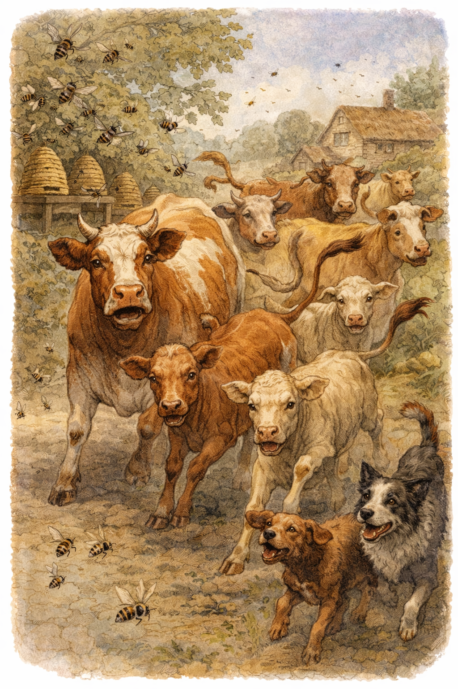

# Characters and Roles

*Each character also has a dedicated bio page: [[Chanticleer]], [[Pertelote]], [[Fox]], [[Widow]], [[Daughters]], [[Hens]], [[Farm‑Animals]].*

## Chanticleer

- **Role:** central rooster, proud and charismatic.
- **Core arc:** confidence from dawn-caller and storyteller to overconfident victim.
- **Function in story:** focal point for the dream-interpretation conflict.

**Dedicated page:** [[Chanticleer]]

## Pertelote (often written as Partlet/Dame Partlet in source)

- **Role:** one of Chanticleer’s wives and key conversational foil.
- **Function:** challenges Chanticleer’s dream, pushes action, and is implicated in the luring sequence.

**Dedicated page:** [[Pertelote]]

## Fox (`Mr. Renard` / fox)

- **Role:** antagonist and predatory patience.
- **Function:** long-game threat; tests Chanticleer’s arrogance and caution.

**Dedicated page:** [[Fox]]

## Widow

- **Role:** caretaker of Chanticleer and household.
- **Function:** establishes the domestic setting and practical stakes.

**Dedicated page:** [[Widow]]

## Daughters

- **Role:** the widow's two daughters, living with her in the cottage.
- **Function:** part of the household; their presence underscores the widow's responsibility and the domestic routine.

**Dedicated page:** [[Daughters]]
## Hens

- **Role:** the other hens in Chanticleer's flock.
- **Function:** provide social context for Chanticleer's life; part of the domestic backdrop.

**Dedicated page:** [[Hens]]

## Farm Animals

- **Role:** background animals in the widow's household.
- **Function:** provide context for the rural setting; include pigs, cows, and sheep that contribute to the widow's livelihood.

**Dedicated page:** [[Farm‑Animals]]

## Other household animals

- **Pigs / Cows / Sheep / Other hens:** contextual world-building; reinforce the rural household setting and routine life.

## Notes on naming consistency

- `Pertelote`, `Partlet`, and `Dame Partlet` are used interchangeably in current text.
- Consider standardizing names in one normalization pass for continuity.
