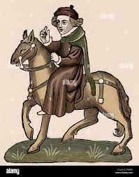

# ✍️ Geoffrey Chaucer

**Geoffrey Chaucer (c. 1343 – 1400)** was an English poet and author, widely regarded as the greatest poet of the Middle Ages. He is best known for *The Canterbury Tales*, a collection of stories told by pilgrims traveling to the shrine of Thomas Becket in Canterbury.

## Role in This Project

This wiki and the accompanying picture‑book project are based on a retelling of **The Nun's Priest's Tale**, one of the most popular stories from *The Canterbury Tales*.

- **Original author**: Chaucer’s original Middle‑English verse provides the narrative foundation.
- **Adaptation approach**: The scenes in this repo re‑tell the tale in modern prose while preserving Chaucer’s character dynamics, humor, and moral undertones.
- **Visual reinterpretation**: The picture‑book illustrations will evoke a medieval ink‑wash aesthetic, suitable for black‑and‑white printing, echoing the manuscript tradition of Chaucer’s time.

## Chaucer and The Canterbury Tales

*The Canterbury Tales* is a frame narrative: a group of pilgrims agree to tell stories to pass the time on their journey. Chaucer’s work is notable for its vivid character sketches, social commentary, and blend of genres—from romance to fabliau to beast fable.

**The Nun's Priest's Tale** is a beast fable featuring Chanticleer the rooster, his wife Pertelote, and a sly fox. It combines humor, dream‑interpretation debate, and a moral about pride and flattery.

## Links

- [[Home]] – Main wiki landing page
- [[Project-Overview]] – Project goals and scope
- [[Story-Outline]] – Summary of the adapted story
- [[Characters-and-Roles]] – Key characters in the tale
- [[Source-Notes]] – Notes on source texts and adaptations

---

*This page serves as a reference to the original author and the literary context of the picture‑book project.*
